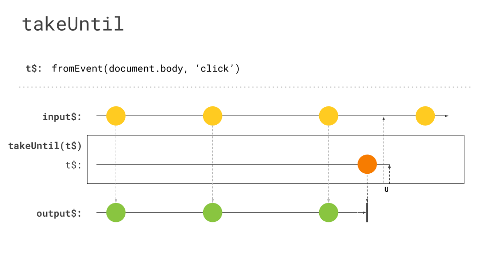

It's already well known, that there are situations where you actually want to unsubscribe from your Observables.
There are several
ways to do this. In several projects, I stumbled across a mixture of using [`takeWhile`](https://rxjs.dev/api/operators/takeWhile) & [`takeUntil`](https://rxjs.dev/api/operators/takeUntil). This raises the question, why are there two of that, which sounds similar and act similarly?

## About TakeWhile

Well, let's take a look at a quick example. The first code snippet we are looking at is using `takeWhile` to unsubscribe from an observable. I used an Angular Component here, to couple the lifecycle of the observable to the lifecycle of the component.
Short disclaimer: It doesn't necessarily need to be an Angular component, it's just the framework I'm the most familiar with.

```ts
@Component({...})
export class MyComponent implements OnInit, OnDestroy {

  private alive = true;

  public ngOnInit() {
    myAwesomeObservable$.pipe(
      takeWhile(val => this.alive)
    ).subscribe();
  }

  public ngOnDestroy() {
    this.alive = false;
  }

}
```

In this code snippet, we have a class property describing the state of the observable. It is passed to the `takeWhile` operator and as soon as this property turns false the observable should be unsubscribed from.
This way of handling subscription is quite imperative and therefore seems to be easier for people to understand.

## About TakeUntil

```ts
@Component({...})
export class MyComponent implements OnInit, OnDestroy {

  private destroyed = new Subject();

  public ngOnInit() {
    myAwesomeObservable$.pipe(
      takeUntil(this.destroyed$)
    ).subscribe();
  }

  public ngOnDestroy() {
    this.destroyed.next();
    this.destroyed.complete();
  }
}
```

From an high-level perspective the code snippets don't look that different. Instead of having a boolean property, describing the state of our observable, we now use a `Subject`.
We pass the `Subject` instance to the `takeUntil` operator and as soon as we want to unsubscribe from our Observable we emit a notification over our `Subject` with the `next` method. The call of the `complete` method isn't necessary for this example, but it is a good practice within the `takeUntil`-Pattern.

## The Problem

So all in all both code snippets look similar and behave similar, right? Well, No!
Let's have a look at the marble diagrams describing those operators because this will highlight the difference between those two operators.


_takeUntil marble diagram, kindly provided by [Michael Hladky](https://twitter.com/Michael_Hladky)_


_takeWhile marble diagram, kindly provided by [Michael Hladky](https://twitter.com/Michael_Hladky)_

The problem here is that `takeWhile` is intended to take an incoming notification, use some comparison on it, which might lead to an unsubscribe. The important fact is, that `takeWhile` is triggered by the incoming notification and might unsubscribe afterwards. `TakeUntil` in contrast is triggered by the passed Observable.
That's why `takeWhile` might cause several issues. So definitely, it needs a new notification to unsubscribe. Imagine having a long-living Observable. You will need one notification more with `takeWhile` than with `takeUntil`. Also, this additional notification can initiate multiple processes within your observable. Imagine having code like this:

```ts
longLivingObservable$
  .pipe(
    tap(() => this.startAnimation()),
    switchMap(val => this.makeHttpCall(val)),
    takeWhile(val => this.alive),
  )
  .subscribe();
```

So what's the issue with this piece of code? Well, our component is already destroyed and due to the needed notification, needed before unsubscribing kicks in, we will start an animation and trigger an HTTP call. This is probably unwanted and just afterwards we will check if we want to unsubscribe from our Observable. Besides the fact that those operations are totally superfluous, it also might break our app or pollute our state.

_Now maybe one might argue: "Well, I could move the `takeWhile` operator at the very beginning of the observable pipeline!"_

That's true, you could do this, and you will save the unneeded operations, which is a good start, but you won't unsubscribe from inner Observables. So if the Observable returned by `makeHttpCall` is a long-living Observable, it will not unsubscribe from that, if the `takeWhile` is before `switchMap` in the pipe. By the way, the same goes for `takeUntil`, so make sure to have the unsubscribe-operator at the very end of your pipe.

## The Solution

Don't get me wrong, `takeWhile` is an amazing operator, but just if you actually use the incoming value to determine, whether you want to unsubscribe or not! Do not depend on "global" state, when using `takeWhile`.
For those scenarios stick to `takeUntil` and use a Subject instance to trigger it.

## Wrap Up

- use takeWhile when the incoming value make you want to unsubscribe
- use takeUntil when there is an outer event determine that you want to unsubscribe
- use both of them as the last operator in your observable pipeline
  - [There's a tslint rule for that](https://github.com/cartant/rxjs-tslint-rules)
